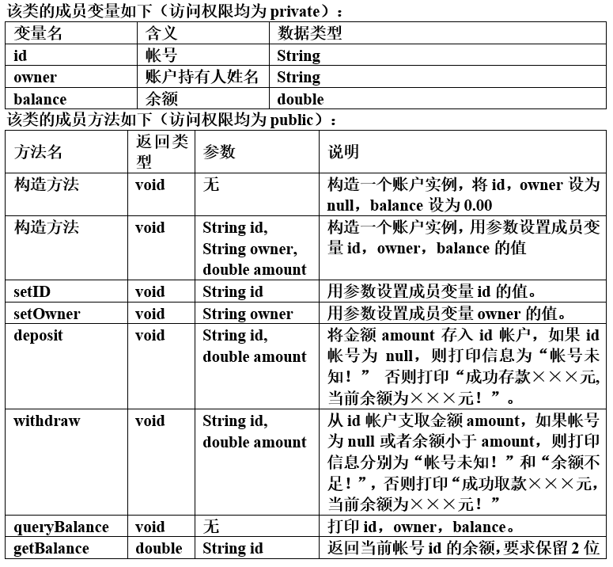

# <center>2019/2020(1) Java程序设计上机实验2</center>

```
班  级:     软工1805
学  号:     201806061219 
姓  名:     王程飞
完成日期:   2019.10.17
```

#### 1. 编写一个三角形类Triangle，能根据3个实数构造三角形对象，如果三个实数不满足三角形的条件，则自动构造以最小值为边的等边三角形。随机产生3个数，求构造的三角形面积。

### 分析
#### 注意三角形边长是否符合条件的算法，0-100 的随机数生成用 Random.nextDouble()*100;
### 代码
```java
class Triangle {
    double a, b ,c;
    Triangle(double a, double b, double c){
        if (a+b<=c || a+c<=b || b+c<=a) {
            final double _a = Math.min(a, Math.min(b, c));
            this.a=this.b=this.c=_a;
            return;
        }
        this.a = a;
        this.b = b;
        this.c = c;
    }
    double area(){
        double p = (a+b+c)/2;
        return Math.sqrt(p*(p-a)*(p-b)*(p-c));
    }
}

private static void test_01() {
    System.out.println("-----------Triangle-----------");
    Random random = new Random();
    double a = random.nextDouble()*100;
    double b = random.nextDouble()*100;
    double c = random.nextDouble()*100;
    Triangle triangle = new Triangle(a, b ,c);
    System.out.println("三角形边长："+triangle.a+", "+triangle.b+", "+triangle.c+"; 面积："+triangle.area());
}

```

### 输出
```shell
-----------Triangle-----------
三角形边长：37.63768786280631, 64.3838718271164, 79.17536035577129; 面积：1198.6739438611119
```

#### 2.编写一个复数类Complex验证两个复数1+2\*i和3+4\*i相加产生一个新的复数4+6\*i。复数类Complex必须满足如下要求：<br>（1）复数类Complex 的属性有：realPart是int型，代表复数的实数部分imaginPart是int型，代表复数的虚数部分。<br>（2）复数类Complex 的方法有：<br>Complex()构造方法，将复数的实部和虚数都置0 <br> Complex(int r, int i)构造方法，形参r为实部的初值，i为虚部的初值。<br> Complex complexADD(Complex a)将当前复数对象与形参复数对象相加，所得的结果仍是一个复数值，将其返回给此方法的调用者。<br>String toString()把当前复数对象的实部、虚部组合成a+b*i的字符串形式，其中，a 和b分别为实部和虚部的数据。

### 分析
#### 定义一个类Triangle并声明两个成员变量，在之后的计算时要注意符号输出
### 代码
```java
public class Complex {
    private int real, imagin;
    Complex() {
        real = 0;
        imagin = 0;
    }

    Complex(int real, int imagin){
        this.real = real;
        this.imagin = imagin;
    }

    Complex complexAdd(Complex complex){
        return new Complex(this.real+complex.real, this.imagin+complex.imagin);
    }

    @Override
    public String toString() {
        if(imagin >= 0) {
            return real+"+"+imagin+"i";
        } else {
            return real+""+imagin+"i";
        }
    }
}

private static void test_02() {
    System.out.println("-----------Complex-----------");
    Complex complex = new Complex(1, 2);
    System.out.println(complex);
    Complex _complex = new Complex(3, 4);
    System.out.println(_complex);
    System.out.println(complex.complexAdd(_complex));
}
```

### 输出
```shell
-----------Complex-----------
1+2i
3+4i
4+6i
```

#### 3.编写一个银行账户类Account，并编写一个main方法，对Account类进行测试，在main方法中要调用Account的所有方法。存取款的步骤：先存入帐号若干元（随机产生），然后取款若干元（随机产生），最后查询帐号信息。



### 代码
```java
import java.text.DecimalFormat;

class Account {

    public void setId(String id) {
        this.id = id;
    }

    public void setOwner(String owner) {
        this.owner = owner;
    }

    public void deposit(String id, double amount) {
        if(!this.id.equals(id)) {
            System.out.println("账号未知");
        } else {
            if (amount<0) {
                System.out.println("存款不能小于0");
                return;
            }
            balance+=amount;
            System.out.println("成功存款 "+amount+" 元, 当前余额 "+balance+" 元");
        }
    }

    public void withdraw(String id, double amount) {
        if(!this.id.equals(id)) {
            System.out.println("账号未知");
        } else if(amount > balance) {
            System.out.println("余额不足");
        } else {
            if (amount<0) {
                System.out.println("取款不能小于0");
                return;
            }
            balance-=amount;
            System.out.println("成功取款 "+amount+" 元, 当前余额 "+balance+" 元");
        }
    }

    public void queryBalance(){
        System.out.println("id: "+id+", owner: "+owner+", balance: "+balance);
    }

    public String getBalance(String id) {
        return new DecimalFormat("#.00").format(balance);
    }

    private String id, owner;
    private double balance;
    Account(){
        id = null;
        owner = null;
        balance = 0.00;
    }
    Account(String id, String owner, double amount) {
        this.id = id;
        this.owner = owner;
        this.balance = amount;
    }
}

private static void test_03() {
    System.out.println("-----------Account-----------");
    Account account = new Account("10000", "abc", 100.00);
    account.queryBalance();
    Random random = new Random();
    account.deposit("10000", random.nextDouble()*100);
    account.withdraw("10000", random.nextDouble()*100);
    account.setId("10001");
    account.setOwner("def");
    System.out.println(account.getBalance("10001"));
    account.queryBalance();
}
```

### 输出
```shell
-----------Account-----------
id: 10000, owner: abc, balance: 100.0
成功存款 90.27758038254748 元, 当前余额 190.27758038254748 元
成功取款 57.95324562974697 元, 当前余额 132.32433475280052 元
132.32
id: 10001, owner: def, balance: 132.32433475280052
```