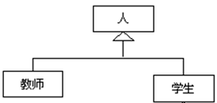

# <center>实验3  类的继承与多态、访问权限的控制<center>

```
班  级:     软工1805
学  号:     201806061219 
姓  名:     王程飞
完成日期:   2019.10.17
```

#### 1. 按以下要求编写程序：
>(1) 编写一个三角形类Triangle，满足以下要求：
    1)定义private的成员变量a,b,c分别表示三角形的三条边。
    2)定义public修饰的setX方法和getX方法，分别对a、b和c进行赋值和返回值，如setA表示对a进行赋值，getA表示返回a的值，以此类推。
    3)定义private修饰的isTriangle方法，判断当前对象的三条边能否构成三角形，如果是则返回true，否则返回false；
    4)定义public修饰的getArea方法，打印三角形的面积。若当前对象无法构成三角形，则打印“边长为a，b和c的三条边无法构成三角形”（打印时，要打印出a、b和c具体的值），否则打印三角形的面积（要求取2位小数）。
(2) 编写测试类TestTriangle，随机生成三个数作为三角形的三条边，打印它们构成三角形的面积。

#### 代码
```java
import java.text.DecimalFormat;
import java.util.Random;

public class TestTriangle {

    public static void main(String[] args) {
        test_01();
    }

    private static void test_01() {
        Random random = new Random();
        double a = random.nextDouble()*100;
        double b = random.nextDouble()*100;
        double c = random.nextDouble()*100;
        Triangle triangle = new Triangle(a, b ,c);
        triangle.getArea();
    }
}


class Triangle {
    private double a, b ,c;
    public double getA() {
        return a;
    }

    public void setA(double a) {
        this.a = a;
    }

    public double getB() {
        return b;
    }

    public void setB(double b) {
        this.b = b;
    }

    public double getC() {
        return c;
    }

    public void setC(double c) {
        this.c = c;
    }

    Triangle(double a, double b, double c) {
        this.a = a;
        this.b = b;
        this.c = c;
    }

    private boolean isTriangle() {
        return !(a + b <= c || a + c <= b || b + c <= a);
    }

    double getArea() {
        if (!isTriangle()) {
            System.out.println("边长为"+
                a+"，"+b+"和"+c+"的三条边无法构成三角形");
            return -1;
        }
        double p = (a+b+c)/2;
        double area = Math.sqrt(p*(p-a)*(p-b)*(p-c));
        System.out.println("三角形边长："+a+", "+b+", "
            +c+"，面积"+new DecimalFormat("#.00").format(area));
        return area;
    }

}
```

#### 结果
三角形边长：77.97483286378088, 96.1034571822503, 71.65327283344952，面积2749.44


#### 2. 用类的继承关系编写程序
>描述下图1中的类层次，其中人为父类Person，其属性包括：姓名、性别、出生日期等，方法为printInfo()打印信息 。教师Teacher还包括学校和工号属性；学生Student还包括学校、学号、专业、年级和班级等属性；编写一个测试类TestPerson，在main方法中创建1个教师和1个学生对象，输出对象的所有属性信息。<br>提高要求（可选做）：将Person、Student和Teacher三个类打包到p1,而测试类TestPerson在工程的缺省包中。


#### 代码
```java
import p1.Student;
import p1.Teacher;

import java.util.Calendar;

public class TestPerson {
    public static void main(String[] args) {
        Calendar calendar1 = Calendar.getInstance();
        calendar1.set(2000, Calendar.JANUARY, 1);
        Student student = new Student("stu-name", 
            '男', calendar1.getTime(), 
            "ZJUT", "201800000000", "majorA", 2, "class-01");
        student.printInfo();
        Teacher teacher = new Teacher("tch-name", 
            '男', calendar1.getTime(), "ZJUT", "000000");
        teacher.printInfo();
    }
}

```

```java
package p1;

import java.text.SimpleDateFormat;
import java.util.Date;

public class Person {
    private String name;
    private char sex;
    private Date birth;

    Person(String name, char sex, Date birth) {
        this.name = name;
        this.sex = sex;
        this.birth = birth;
    }

    @Override
    public String toString() {
        return "姓名 "+name+", 性别 "+sex
            +", 出生日期 "+new SimpleDateFormat("YYYY/MM/dd").format(birth);
    }

    public void printInfo() {
        System.out.println(this);
    }
}

```
```java
package p1;

import java.util.Calendar;
import java.util.Date;

public class Student extends Person {
    private String school, id, major, cls;
    private int grade;

    public Student(String name, char sex, Date birth, String school, String id, 
        String major, int grade, String cls) {
        super(name, sex, birth);
        this.school = school;
        this.id = id;
        this.major = major;
        this.cls = cls;
        this.grade = grade;
    }

    @Override
    public String toString() {
        return super.toString()+"\n"
                +"学校 "+school+", 学号 "+id+", 专业 "+major+", 年级 "
                +grade+", 班级"+cls;
    }
}
```
```java
package p1;

import java.util.Date;

public class Teacher extends Person {
    private String school, id;

    public Teacher(String name, char sex, 
        Date birth, String school, String id) {
        super(name, sex, birth);
        this.school = school;
        this.id = id;
    }

    @Override
    public String toString() {
        return super.toString()+"\n"
                +"学校 "+school+", 工号 "+id;
    }
}

```

#### 结果
姓名 stu-name, 性别 男, 出生日期 2000/01/01
学校 ZJUT, 学号 201800000000, 专业 majorA, 年级 2, 班级class-01
姓名 tch-name, 性别 男, 出生日期 2000/01/01
学校 ZJUT, 工号 000000


#### 3. 
>(1) 编写一个抽象类Animal，其成员变量有name，age，weight表示动物名、年龄和重量。方法有showInfo()、move()和eat()，其中后面两个方法是抽象方法；编写一个类Bird继承Animal，实现相应的方法，通过构造方法给name，age，weight分别赋值，showInfo()打印鸟名、年龄和重量，move()方法打印鸟的运动方式，eat()打印鸟喜欢吃的食物；编写一个类Dog继承Animal，实现相应的方法，通过构造方法给name，age，weight分别赋值，showInfo()打印狗名、年龄和重量，move()方法打印狗的运动方式，eat()打印狗喜欢吃的食物；最后编写测试类TestAnimal，用Animal类型的变量，调用Bird和Dog对象的三个方法。<br>提高要求（可选做）：将Animal、Bird和Dog三个类打包到p3,而测试类TestAnimal在工程的缺省包中。

#### 代码
```java
import p3.Bird;
import p3.Dog;

public class TestAnimal {
    public static void main(String[] args) {
        Dog dog = new Dog("little-dog", 2, 4.3);
        dog.eat();
        dog.move();
        dog.showInfo();
        Bird bird = new Bird("little-bird", 1, 0.10);
        bird.eat();
        bird.move();
        bird.showInfo();
    }
}
```
```java
package p3;

public abstract class Animal {
    String name;
    int age;
    double weight;
    Animal(String name, int age, double weight) {
        this.name = name;
        this.age = age;
        this.weight = weight;
    }
    public abstract void eat();
    public abstract void move();
    public abstract void showInfo();
}
```
```java
package p3;

public class Bird extends Animal {
    public Bird(String name, int age, double weight) {
        super(name, age, weight);
    }

    @Override
    public void eat() {
        System.out.println("鸟喜欢吃虫子");
    }

    @Override
    public void move() {
        System.out.println("鸟会飞");
    }

    @Override
    public void showInfo() {
        System.out.println("鸟, 名字："+name
            +", 年龄："+age+", 体重："+weight+" kg");
    }
}
```
```java
package p3;

public class Dog extends Animal {
    public Dog(String name, int age, double weight) {
        super(name, age, weight);
    }

    @Override
    public void eat() {
        System.out.println("狗喜欢吃肉");
    }

    @Override
    public void move() {
        System.out.println("狗会跑");
    }

    @Override
    public void showInfo() {
        System.out.println("狗, 名字："+name
            +", 年龄："+age+", 体重："+weight+" kg");
    }
}

```

#### 结果
狗喜欢吃肉
狗会跑
狗, 名字：little-dog, 年龄：2, 体重：4.3 kg
鸟喜欢吃虫子
鸟会飞
鸟, 名字：little-bird, 年龄：1, 体重：0.1 kg
